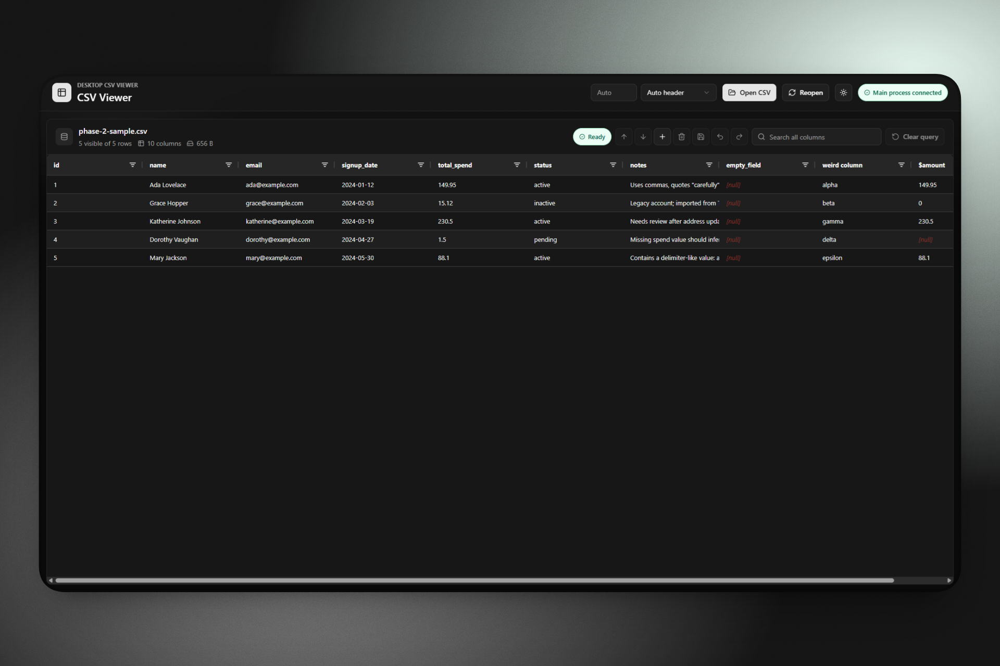

# CSV Viewer

A fast local desktop app for opening, inspecting, filtering, and cleaning CSV files without uploading them anywhere.

<p align="center">
  
</p>

CSV Viewer is built for practical CSV work: open files from disk, browse large datasets smoothly, adjust parsing options, search and filter rows, make focused cleanup edits, then export a separate CSV with Save As.

## Highlights

- **Local-first desktop workflow.** CSV files are opened by the Electron app from your filesystem; source files are never uploaded or overwritten implicitly.
- **Large-file friendly browsing.** DuckDB handles CSV querying while the renderer requests bounded row windows instead of loading the full dataset into React state.
- **Rich table interaction.** AG Grid provides sorting, filtering, column resizing, horizontal scrolling, and focused row inspection for wide or messy files.
- **CSV-aware controls.** Delimiter, header, quoting, and escape handling can be adjusted when a file needs explicit parsing settings.
- **Safe cleanup edits.** Edit cells, insert or append rows, delete rows, undo/redo changes, and write the result with Save As.

## Stack

Electron, React, TypeScript, AG Grid Community, DuckDB, Vite, Vitest, and pnpm.

## How It Works

CSV files are opened from disk by the Electron main process, queried through DuckDB, and displayed in the renderer through paged row-window requests so the full dataset is not held in React state. The active CSV can be edited in memory and written with Save As; the original file is not overwritten.

## Requirements

- Node.js 24 or newer
- pnpm 10.34.2

## Scripts

```powershell
pnpm install
pnpm run dev
pnpm run typecheck
pnpm run test
pnpm run build
pnpm run package
```

- `dev` starts Vite and launches Electron against the local dev server.
- `typecheck` checks renderer, shared, main, and preload TypeScript.
- `test` runs the Vitest suite for data access and grid request behavior.
- `build` creates `dist-renderer/` and `dist-electron/`.
- `package` builds the app and creates platform installers under `release/`.

## CSV Editing

The grid supports focused CSV cleanup workflows:

- Inline cell edits. Values are treated as text, preserving identifiers such as leading-zero codes.
- Insert row above or below one selected source row when no sort, filter, or search is active.
- Append an empty row when no rows are selected and no sort, filter, or search is active.
- Delete one or more selected rows.
- Undo and redo cell edits, row inserts, and row deletes.
- Save As writes a separate CSV using the active delimiter and header settings.

Editing controls are intentionally disabled when the requested operation would be ambiguous. Row insertion is blocked under active sort, filter, or search because the visible order is derived from a query, but cell edits and deletes still target stable source row identifiers in those views.

## Development

Before shipping changes, run `pnpm run test`, `pnpm run typecheck`, and `pnpm run build`. See [docs/validation.md](docs/validation.md) for manual release and editing validation scenarios.

## Packaging Notes

`pnpm run package` uses `electron-builder` to produce platform-specific release artifacts in `release/`. On Windows this creates an NSIS installer and a portable executable; the GitHub Actions release workflow also builds a macOS DMG and Linux AppImage on their native runners.

Recent files are stored in Electron's per-user `userData` directory as `recent-files.json`. The source CSV files are never modified.

## Known Limitations

- Save As is the only persistence path. The original CSV is never overwritten implicitly.
- Cell values are edited as text. Numeric, date, and boolean validation is not enforced.
- Column insertion, deletion, renaming, and reordering are not supported.
- Row insertion is disabled while sort, filter, or search is active.
- Only one active CSV session is supported.
- Recent files store local file paths only and do not track moved or deleted files until reopening fails.
- Advanced spreadsheet features such as formulas, pivot tables, charts, joins, and SQL editing are out of scope.
- Long-running general CSV queries can be superseded at the renderer request level but are not forcibly killed. Comparison generations use dedicated workers that are interrupted when cancelled.
