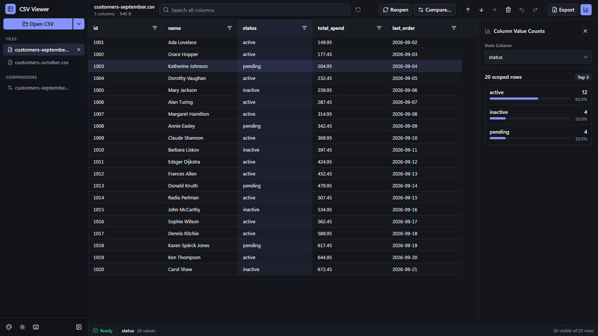
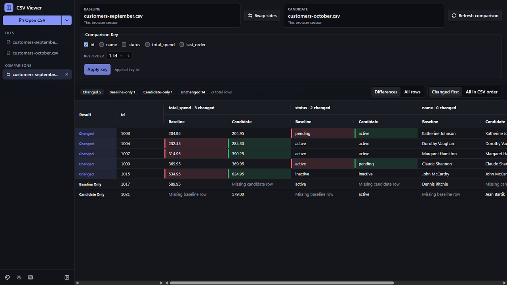

# CSV Viewer

CSV Viewer opens, filters, edits, and compares CSV files on your device. It runs as a desktop app or in the browser, and it never uploads your files.

**[Try it in your browser](https://csv-viewer.vercel.app).** No install is needed.

<p align="center">
  
</p>

## Features

- Sort, filter, and search large CSV files.
- Edit cells, rows, and columns, with undo and redo.
- Keep several files open in tabs. Each tab has its own edits and query.
- Compare two files by a key and see which cells and rows differ.
- Count the values in a column.
- Copy a cell or a whole column.
- Export the whole working copy or just the current view to a new file. CSV Viewer never overwrites the source file.
- Pick light or dark mode, one of four color palettes, and a collapsible sidebar.

## Open a file

Drop CSV, TSV, or TXT files into the window, or click **Open CSV**. You can drop several files at once. Tabs that are already open keep their edits.

If a file opens with the wrong columns, click **Parse options** beside **Open CSV** and set the delimiter and the header mode. The settings apply to the next open or **Reopen**.

**Reopen** reloads the source into the same tab. It resets the tab's query, selection, stats, and edit history. If the tab has unexported changes, CSV Viewer asks before it discards them.

## Edit and export

Double-click a cell to edit it. CSV Viewer keeps every value as text, so codes with leading zeros keep their zeros. Edits change a working copy, and the tab shows **Unexported Changes** until you export the whole working copy.

- To insert a row, select one row and insert above or below it. The current query can hide the new row.
- To append a row, clear the row selection and the query first.
- To delete rows, select them and delete.
- To rename, insert, or delete a column, right-click its header. A column name must be nonblank, unique, and not reserved. You can't delete the last column.
- To undo or redo a cell, row, or column change, click **Undo edit** or **Redo edit**. Undoing a column deletion restores the column's values and position.

To save your edits, click **Export CSV**. The export contains the whole working copy with the file's delimiter and header settings. Search, filters, and sort don't affect it. On desktop, you pick a destination, and CSV Viewer refuses to overwrite the source file. On the web, the browser downloads the file. Closing a tab with unexported changes asks for confirmation.

To extract matching rows, open **Export options** beside Export and choose **Export current view**. It includes every matching row in the current sort order, even beyond the loaded grid. All columns keep their working-copy order, regardless of row selection or dragged headers. The menu shows the matching count and disables the action while the count is unresolved or zero.

An active cell editor commits first; a failed commit keeps its draft open. You can **Cancel** while the app prepares the output. Delivery suggests a `-view` filename and keeps the current delimiter and header settings. View export preserves **Unexported Changes** and undo/redo history, even when every row matches.

## Search, copy, and count values

**Global search** matches across all columns. Column headers sort and filter. On a text column, the filter lists the column's top values with their row counts: search for text, or check and uncheck values to keep or hide them. Right-click a text cell to filter to that value or exclude it. **Clear query** resets the search, filters, and sort.

Press `Ctrl+C` to copy the focused cell. To copy a column, right-click its header and choose **Copy column**. The copy holds the values that match the current query, in the current sort order, one per line, without the header. Null values become empty lines.

The stats panel shows **Column Value Counts** for the focused column. To count another column, choose it in **Stats Column**. Counts and percentages follow the current search and filters, and they update after edits. Blank values and null values are counted separately.

## Compare two files

Both files need the same column names, in any order. Open both files, click **Compare**, and choose a key of one or more columns. The key value must be present and unique in every row of both files. If it isn't, CSV Viewer lists the blank and duplicate key values.

The comparison uses both working copies, including unexported changes, and ignores search and filters. It shows changed cells, unchanged rows, and rows found in only one file. You can show only the differences, swap the baseline and the candidate, or cancel a running comparison. If you edit or reopen either file, the result is marked outdated until you refresh it. Closing a source tab also closes its comparisons.

<p align="center">
  
</p>

## Keyboard shortcuts

Press `Ctrl+/` or click **Keyboard shortcuts** in the sidebar to show the shortcut panel. On macOS, use `Cmd` instead of `Ctrl`.

| Shortcut | Action |
| --- | --- |
| `F2` on a column header | Rename the column. |
| `F2` on a cell | Edit the cell. |
| `Ctrl+C` on a cell | Copy the cell. |
| `Ctrl+Shift+A` | Copy the focused column. Doesn't work inside a text field. |
| `Ctrl+/` | Show or hide the shortcut panel. |

## Desktop and web differences

| Behavior | Desktop | Web |
| --- | --- | --- |
| Opening files | Native file dialog or file drop. | Browser file picker or file drop. |
| Recent files | Kept across restarts. Missing files drop off the list. | None. Files last only for the page session. |
| Opening the same file again | Focuses its existing tab. | Opens a new, independent tab. |
| Export | Saves to a destination you pick. | Downloads the file. |
| File size | Limited by your machine's resources. | 100 MB per file and 200 MB across all open files, counted in source bytes. |

On the web, a few more rules apply:

- If your browser isn't supported, CSV Viewer says so and points you to the desktop app.
- Reloading or leaving the page loses your files and edits. The browser asks first if you have unexported changes.
- If the data engine stops, the page shows **The workspace stopped**. Click **Reload CSV Viewer** to start a new, empty session.

## Limitations

- Values are plain text. CSV Viewer doesn't validate numbers, dates, or booleans.
- You can't append a row while a sort, filter, or search is active.
- Dragging headers changes their visual arrangement; exports keep working-copy column order.
- CSV Viewer has no formulas, pivot tables, charts, joins, or SQL editor.

## Run from source

You need Node.js 24 or newer and pnpm 10.34.2. If you use mise, `mise.toml` pins both.

```powershell
pnpm install
pnpm run dev:desktop
```

To run the web app, use `pnpm run dev:web` instead.

`pnpm build` builds both apps. `pnpm package` builds desktop installers into `release/`: a Windows installer and portable executable, a macOS DMG, or a Linux AppImage, depending on your platform.

To test, debug, or change the code, see [CONTRIBUTING.md](CONTRIBUTING.md).
